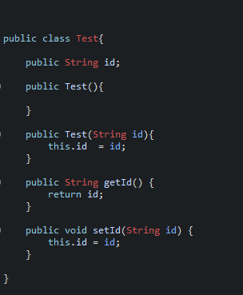
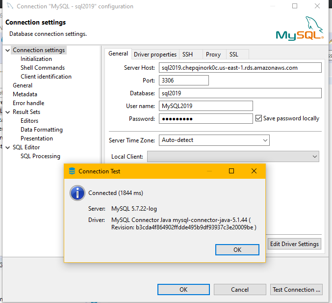

# SpringAplicationAWS
  

Este tutorial explica como  crear sitios dinamicos en S3, y como crear una aplicacion que se concete a una base de datos (RDS) en AWS y como desplegra dicha apliacion en EC2.
## Video Tutorial
[# Tutorial AWS con S3, EC2 y RDS](https://www.youtube.com/watch?v=cy3mKWm5g6g)
## Creacion Sitio S3

 1. Primero se crea un bucket con minusculas y debe ser unico  

 
 2. Desmarcar oipcion de acceso publico 
 
 
 3. Se deben cargar archvios al bucket
 
 4. Agregar opcion hacer publico
 
 5. Abrir url proporcionada por el bucket 
 
 
 

## Creacion Aplicaion web 

 1. Clonar el repositorio
 2. Modificar el archivo aplication Properties con las credenciales de la base de datos
 
 
 3. Se debe modificar el modelo que va a ser mapeado a la base de datos(se debe anadir getters y setters)
 
 
 4. Se debe crear  la consulta y luego construit un objeto el cual va a ser ingreaso a la base datos 
 
 
 5. Para ejecutar la apliacion localmnete se debe ejecutar el comando `mvn spring-boot:run`  y luego acceder a la url `localhost:8080/prueba1`

## Creacion Base de Datos

 1. Damos clic en la pestaña de RDS y luego crear database
 
 
 2. Creamos la abse de datos con el motor del gusto  de cada uno 
 
 
 3. Se agrega un usuario una constraseña 
 
 
 4. En la seccion de conffiguraciones adicionales agregamos los vpc  Security Groups (se recomienda agregar el Security Group `default` y otro que tambien tenga la maquina virtual EC2 en este caso `EC2-SG`) y agregamos la opcion de hacer publica la base de datos
 
 5. Se agrega un nombre a la base de datos
 
 6. Luego de ser creada la base de datos se recomienda probar su conexion en este caso DBeaver

 7. Se debe insertar datos a la base de datos
 
## Creacion y Despliegue EC2
 1. Se crea un instancia nueva y se crea un Security Group el cual es el que se debe agregar a la base datos en este caso `EC2-SG`
 
 
 3. Luego se ingresa a la Maquina virtual (VER `VIDEO link`)
 4. Se Modificar java en la Maquina virtual `yum remove java-1.7.0-openjdk -y yum install java-1.8.0`
 5. Se debe anadir el archivo jar (VER `VIDEO link`) para poder correr el comando `java -jar <jarFile.jar>`

### Pre-requisitos  
  

Solo se debe tener instalado java, y tener una cuenta en AWS  
  
  
## Autor  
  

* **Javier Vargas** - *ECI*  
  

## License  
  

Este proyecto está licenciado bajo GNU  License v3.0 - ver [LICENSE](LICENSE) para más detalles.  
  

